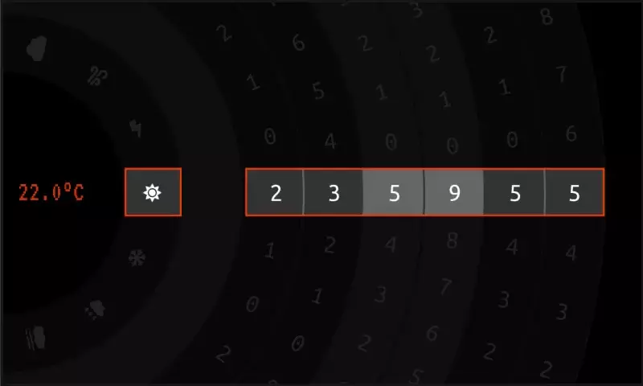
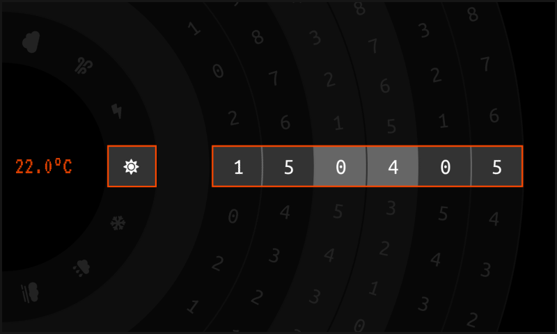
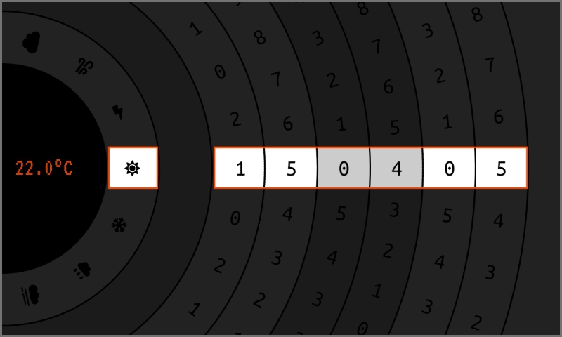

# Disc Clock

This is my submission to the [Flutter Clock Challenge](https://flutter.dev/clock). The clock face 
is inspired by the paper code wheels that used to be shipped with computer games.

To explain my "programmer art" a little… The idea is that the code wheel is behind a sheet of 
translucent acrylic with a window to expose the time and weather. The temperature is displayed on 
a digital screen in the centre of the code wheel.

It has a light theme and a dark theme, supports 24 and 12 hour modes, and displays sample weather 
data.

## Device

This clock face was developed and tested on the Nexus S Android 9.0 Emulator, with a resolution of 
480 × 800 (HDPI); a close match for the Lenovo Smart Clock.

### Bug

When deleting the `android` directory in this repo and then recreating it with `flutter create .`, 
the Android emulators do not hide the system UI overlays correctly and leaves a gap that throws 
off the widgets' positioning.

## Third Party Materials

The temperature display uses the [VT323-Regular](https://fonts.google.com/specimen/VT323) font, 
permission for use is granted by the SIL Open Font License 1.1 
(see third_party/VT323-Regular-license.txt).

The font used for the numerals on time disc images is [Ubuntu Mono](https://design.ubuntu.com/font/)
, permission for use is granted by the Ubuntu Font License 1.0 
(see third_party/UbuntuFont-license.txt).

The weather disc image uses icons from the [Font Awesome](https://fontawesome.com/) Free library, 
permission for use is granted by the CC BY 4.0 License 
(see third_party/FontAwesomeFree-license.txt).

## License

The code in this submission is released under the MIT License, the image files are released under 
the [CC BY 4.0 License](https://creativecommons.org/licenses/by/4.0/).

## To Do

* Responsive layout
* Performance optimisation
